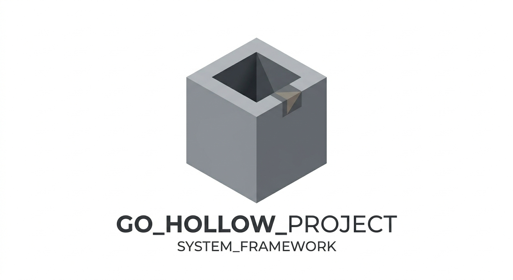

# Hollow



**Hollow** est un éditeur de texte TUI (Terminal User Interface) moderne écrit en Go. Il fusionne la simplicité d'utilisation de **Nano** avec la puissance de navigation et de gestion de fichiers distants de **mcedit** (Midnight Commander).

Ce projet est conçu avec l'ia, dans un but récréatif et pédagogique.


## Fonctionnalités

- **Explorateur de fichiers intégré** : Navigation fluide dans l'arborescence locale.
- **Éditeur de texte complet** : Support des fonctionnalités standards d'édition.
- **Système de Fichiers Virtuel (VFS)** : Architecture prête pour le support FTP et Archives.
- **Presse-papier système** : Copier-coller intégré avec l'OS (X11/Wayland).
- **Aide contextuelle** : Barre de raccourcis dynamique et documentation interactive via `F1`.

## Architecture Technique

Le projet est construit de manière modulaire :

- `main.go` : Point d'entrée, initialise l'application.
- `internal/app/` : Cœur de l'application (UI, Handlers, Actions).
- `internal/vfs/` : Abstraction et implémentations du système de fichiers (VFS).
- `internal/utils/` : Constantes d'aide et formatage utilitaire.

### Le coeur : L'interface VFS

L'extensibilité du projet repose sur l'interface `VFS`, permettant d'ajouter des protocoles sans modifier l'UI :

```go
type VFS interface {
    List(path string) ([]FileInfo, error)
    Read(path string) (io.ReadCloser, error)
    Write(path string, data io.Reader) error
}
```

## Raccourcis Clavier

| Touche | Action |
| :--- | :--- |
| `F1` | Afficher l'aide interactive |
| `TAB` | Basculer de l'explorateur vers l'éditeur |
| `Ctrl + X` | Revenir à la liste (depuis l'éditeur) / Quitter (depuis la liste) |
| `F10` | Quitter l'application |
| `Ctrl + F` | Créer un nouveau fichier |
| `Ctrl + D` | Créer un nouveau dossier |
| `Ctrl + R` | Supprimer le fichier ou dossier sélectionné |
| `Ctrl + K` | Copier le fichier ou dossier sélectionné |
| `Ctrl + U` | Coller l'élément dans le dossier actuel |
| `Ctrl + S` | Sauvegarder le fichier courant |
| `Ctrl + K` | Couper la ligne actuelle (Éditeur) |
| `Ctrl + U / V` | Coller le texte (Éditeur) |
| `Entrée` | Ouvrir un fichier ou entrer dans un dossier |

## Installation & Utilisation

### Prérequis

- Go 1.18+
- `xclip`, `xsel` ou `wl-clipboard` (pour le support du presse-papier sur Linux)

### Lancement

```bash
go run .
```

## État du Projet

### Implémenté
- Navigation locale avec gestion des métadonnées (taille).
- Lecture et écriture réelle sur le disque.
- Architecture factorisée pour la maintenabilité.
- Barre de chemin dynamique et interface réactive.

### En cours / À venir
- [ ] **Client FTP** : Implémentation de `FTPFS` pour l'édition distante.
- [ ] **Explorateur d'archives** : Support des fichiers `.zip` et `.tar.gz`.
- [ ] **Recherche avancée** : Logique de recherche textuelle avec surlignage.

---
*Dernière mise à jour : Samedi 11 Avril 2026 - 17:12*