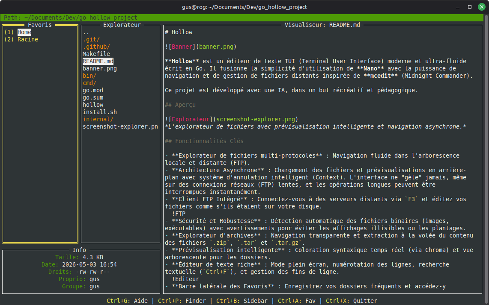

# Hollow


**Hollow** est un éditeur de texte TUI (Terminal User Interface) moderne et ultra-fluide écrit en Go. Il fusionne la simplicité d'utilisation de **Nano** avec la puissance de navigation et de gestion de fichiers distants inspirée de **mcedit** (Midnight Commander).

Ce projet est développé avec une IA, dans un but récréatif et éducatif.

## Aperçu


*L'explorateur de fichiers avec prévisualisation intelligente et navigation asynchrone.*

## Fonctionnalités Clés

- **Explorateur de fichiers multi-protocoles** : Navigation fluide dans l'arborescence locale et distante (FTP).
- **Architecture Asynchrone** : Chargement des fichiers et prévisualisations en arrière-plan avec système d'annulation intelligent. L'interface ne "gèle" jamais, même sur des connexions lentes.
- **Client FTP Intégré** : Connectez-vous à des serveurs distants via `F3` et éditez vos fichiers comme s'ils étaient sur votre disque.
  !FTP
- **Sécurité et Robustesse** : Détection automatique des fichiers binaires (images, exécutables) avec avertissements pour éviter les affichages illisibles ou les plantages.
- **Explorateur d'archives** : Navigation transparente et extraction à la volée du contenu des fichiers `.zip`, `.tar` et `.tar.gz`.
- **Prévisualisation intelligente** : Coloration syntaxique temps réel (via Chroma) et vue arborescente pour les dossiers.
- **Éditeur de texte riche** : Mode plein écran, numérotation des lignes, recherche textuelle (`Ctrl+F`), et gestion des fins de ligne.
  !Éditeur
- **Aide Contextuelle Dynamique** : Appuyez sur `F1` à tout moment pour voir les raccourcis spécifiques au mode actuel (Explorateur, Archive ou Éditeur).
  !Aide

## Architecture Technique

Le projet repose sur une abstraction puissante du système de fichiers (**VFS**) située dans `internal/vfs/`, permettant d'ajouter facilement de nouveaux protocoles (SFTP, S3, etc.) sans toucher à la logique de l'interface utilisateur.

## Raccourcis Clavier

### Navigation (Explorateur / Visualiseur)
| Touche | Action |
| :--- | :--- |
| `F1` | Aide contextuelle (Explorateur/Archive) |
| `F3` | Ouvrir le dialogue de connexion FTP |
| `TAB` / `Ctrl + X` | Basculer focus entre l'Explorateur et le Visualiseur |
| `Entrée` | Ouvrir un fichier ou entrer dans un dossier / archive |
| `Ctrl + F` | Créer un nouveau fichier |
| `Ctrl + D` | Créer un nouveau dossier |
| `Suppr` | Supprimer l'élément sélectionné |
| `Ctrl + E` | Extraire une archive (ou un fichier d'une archive) |
| `Ctrl + K` / `Ctrl + U` | Copier / Coller un élément |
| `Ctrl + X` | Quitter Hollow (quand l'Explorateur a le focus) |

### Édition (Éditeur Plein Écran)
| Touche | Action |
| :--- | :--- |
| `F1` | Aide contextuelle (Édition) |
| `Ctrl + S` | Sauvegarder les modifications |
| `Ctrl + F` | Rechercher dans le texte (Suivant avec Entrée) |
| `Ctrl + K` | Couper la ligne actuelle (Nano-style, concatène si répété) |
| `Ctrl + U` | Coller le bloc de lignes coupé |
| `Esc` / `Ctrl + X` | Fermer l'éditeur (confirmation si non sauvegardé) |

## Installation & Utilisation

### Prérequis
- `curl` et `wget` (pour l'installation rapide)

### Installation (Utilisateurs)
Pour installer la version native pré-compilée sur Linux (Debian, Ubuntu, Kali, etc.) sans avoir besoin de Go :

```bash
curl -sL https://raw.githubusercontent.com/EducLecomte/go_hollow_project/main/install.sh | bash
```

Ou via le script local si vous avez déjà cloné le projet :
```bash
chmod +x install.sh
./install.sh
```

---
*Dernière mise à jour majeure : Dimanche 12 Avril 2026 - 17:35*